# CleverSearch 발표 시나리오 — 강광민

> **담당 영역**: 검색 엔진 / 검색 화면 / 검색 운영 관리 / 관리자 UI 프레임 / 인증·보안
> **커밋 41건** — `app/services/search_service.py`, `app/api/v1/search.py`, `static/user/index.html`, `static/admin/index.html` 주 작성자
> **시연 환경**: `http://127.0.0.1:8000` · 관리자 계정 `admin / admin123!`
> **색인된 데모 문서 4건**: 연구개발계획서_작성중.docx, 통합검색솔루션_종합문서.xlsx, AI개발진행.pptx, 2026_운영지침_보안.pdf.jpg

---

## 한 줄 요약

**"흩어진 사내 문서를 한 검색창에서 찾고, 그 검색이 잘 되고 있는지를 관리자가 숫자로 확인하고 튜닝하는 시스템"**

---

# PART 1. 사용자 검색 화면

## 1-1. 검색 메인

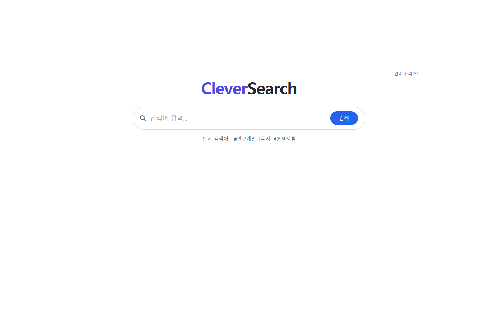

**시연 동작**: `http://127.0.0.1:8000` 접속

**설명 포인트**
- 로그인 없이 누구나 쓰는 대국민/사내 공개 검색 화면입니다. 구글처럼 검색창 하나만 두고 시작합니다.
- 검색창 아래 **인기 검색어**(`#연구개발계획서` `#운영지침`)는 실제 검색 로그를 집계해서 자동으로 뽑아냅니다. 하드코딩이 아닙니다.
- 문서 뷰어, 검색 상태 복원(뒤로가기 시 이전 검색 결과·스크롤 위치 유지)까지 포함된 화면입니다.

**말할 거리**: "검색은 첫인상이 전부라서, 로그인·메뉴 없이 검색창만 남겼습니다."

---

## 1-2. 검색 실행 — "운영지침"

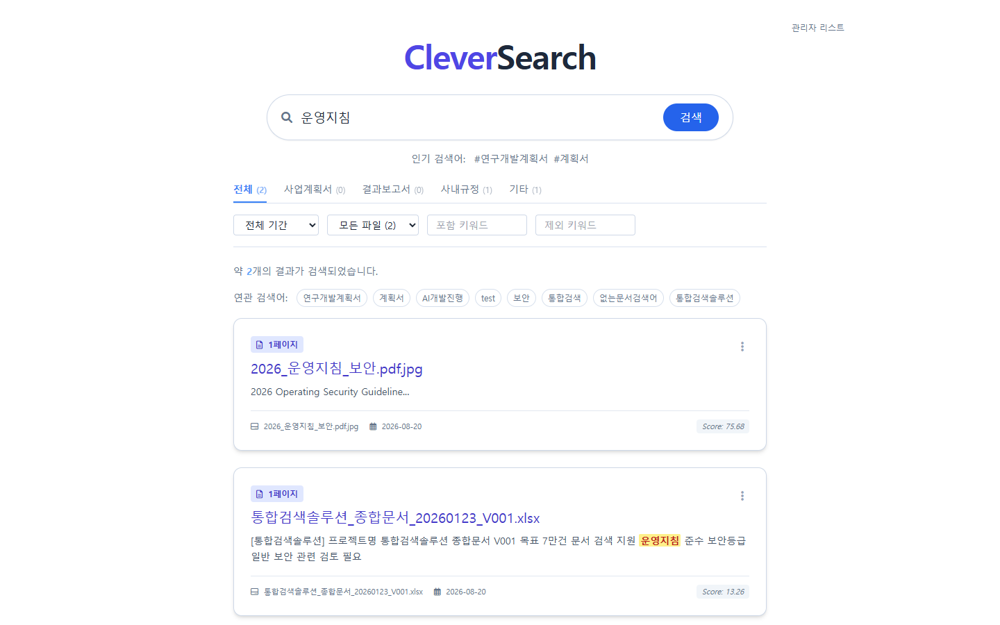

**시연 동작**: 검색창에 `운영지침` 입력 → 엔터

**설명 포인트**
- **2건**이 나옵니다. 여기서 강조할 것은 **"파일 이름에 운영지침이 없는 문서도 잡혔다"** 는 점입니다.
  - `2026_운영지침_보안.pdf.jpg` — 이미지 파일인데 OCR로 텍스트를 뽑아 색인
  - `통합검색솔루션_종합문서.xlsx` — 본문 안에 "운영지침 준수" 문구가 있어서 매칭, 해당 부분이 **노란색 하이라이트**로 표시됨
- 오른쪽 아래 `Score: 75.68`, `Score: 13.26` — 관련도 점수입니다. 이 점수 계산 규칙을 관리자가 직접 조정할 수 있다는 게 뒤에 나올 **검색 품질** 메뉴로 연결됩니다.
- **연관 검색어**가 결과 위에 칩 형태로 붙습니다.
- 상단 카테고리 탭(전체/사업계획서/결과보고서/사내규정/기타)에 **건수가 실시간으로 같이 표시**됩니다.

**말할 거리**: "제목만 훑는 게 아니라 본문까지 들어가서, 어디가 맞았는지 하이라이트로 보여줍니다."

---

## 1-3. 오타 교정 ★ 핵심 시연

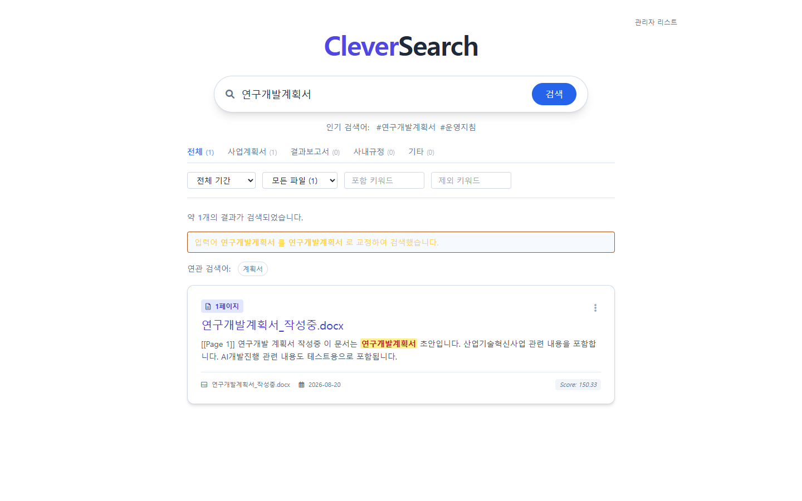

**시연 동작**: 검색창에 일부러 틀리게 `연구개발게획서` 입력 → 엔터
> **"계"를 "게"로 잘못 친 상황입니다.**

**설명 포인트**
- 결과 위에 안내 문구가 뜹니다:
  > **입력어 `연구개발게획서` 를 `연구개발계획서` 로 교정하여 검색했습니다.**
- 그리고 정상적으로 `연구개발계획서_작성중.docx` 1건을 찾아냅니다. **오타를 쳤는데 결과가 나옵니다.**
- 동작 원리: 오타로 검색 → 결과 0건 감지 → 자모 분해 기반 유사어 후보 생성 → 색인된 용어와 대조 → 가장 가까운 것으로 재검색.
- 초성 검색(`ㅇㅇㅈㅊ` → 운영지침)도 같은 계열 기능입니다.

**말할 거리**: "실무에서 검색이 안 된다는 민원의 상당수가 오타입니다. 이걸 사용자한테 '다시 치세요' 하지 않고 시스템이 알아서 처리합니다."

---

## 1-4. 카테고리 · 상세 필터


**시연 동작**: `계획서` 검색 → 상단 **사업계획서** 탭 클릭

**설명 포인트**
- 카테고리 탭으로 문서 종류를 좁힙니다. 탭 옆 괄호 숫자가 해당 분류의 건수입니다.
- 그 아래 상세 필터 4종:
  - **전체 기간** — 기간 필터
  - **모든 파일** — 확장자 필터 (docx / xlsx / pptx / pdf / 이미지)
  - **포함 키워드** — 반드시 들어가야 할 단어
  - **제외 키워드** — 빼고 볼 단어
- 필터를 걸어도 검색 상태가 유지되어, 문서를 열었다가 뒤로 가면 **필터·스크롤 위치가 그대로 복원**됩니다.

**말할 거리**: "찾는 것까지가 반이고, 좁히는 게 나머지 반입니다."

---

# PART 2. 관리자 — 검색 운영

## 2-1. 관리자 로그인 (인증 / 권한)

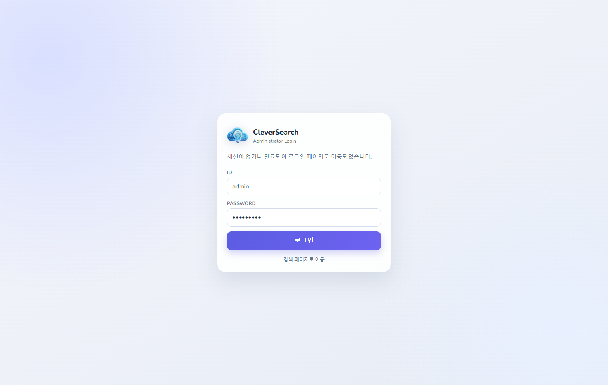

**시연 동작**: `http://127.0.0.1:8000/admin` 접속 → `admin / admin123!` 로그인

**설명 포인트**
- **JWT 기반 인증**입니다. 로그인하면 access token(30분) + refresh token(24시간)을 발급받습니다.
- **RBAC 3단계 권한**: `viewer`(조회만) / `operator`(운영 작업) / `admin`(전체)
  - viewer로 로그인하면 쓰기 버튼이 자동으로 비활성화되고 "viewer 권한으로는 사용할 수 없습니다" 툴팁이 붙습니다.
- **브루트포스 차단**: 5회 실패 시 15분 차단 (`AUTH_RATE_LIMIT_*`)
- 세션 만료 타이머가 우측 상단에 표시되고, **연장** 버튼으로 갱신합니다.
- 그 외 적용된 보안: CSP 헤더, CORS 화이트리스트, 신뢰 호스트 검증, 자격증명 AES-256 암호화, 폐기 토큰 관리.

**말할 거리**: "관리자 화면은 사내망이라도 인증·권한·감사가 다 걸려 있어야 합니다."

---

## 2-2. 대시보드 ★ 핵심 시연

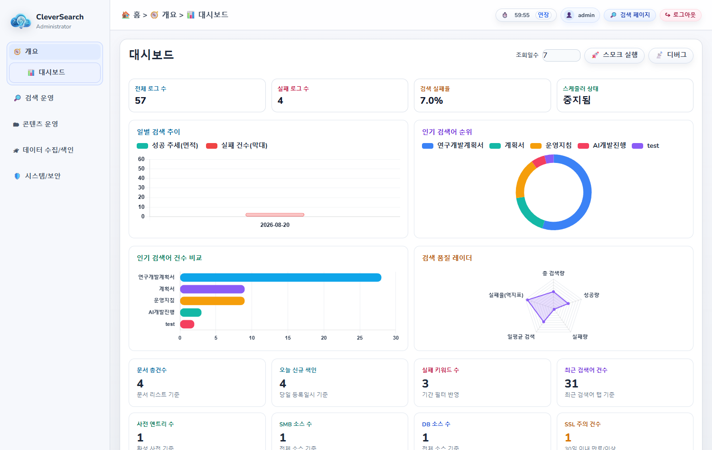

**시연 동작**: 로그인 직후 자동 진입

**설명 포인트 — 상단 카드 4개**
| 지표 | 의미 |
|---|---|
| 전체 로그 수 | 누적 검색 횟수 |
| 실패 로그 수 | 결과 0건이었던 검색 |
| **검색 실패율** | 실패÷전체 — **이 시스템의 핵심 건강 지표** |
| 스케줄러 상태 | 자동 색인 동작 여부 |

**차트 4종**
- **일별 검색 추이** — 성공(면적) + 실패(막대) 이중축
- **인기 검색어 순위** — 도넛 차트
- **인기 검색어 건수 비교** — 가로 막대
- **검색 품질 레이더** — 총 검색량 / 성공량 / 실패량 / 일평균 / 실패율(역지표) 5축

**하단 통계 타일 8종** — 문서 총건수, 오늘 신규 색인, 실패 키워드 수, 최근 검색어 건수, 사전 엔트리 수, SMB 소스 수, DB 소스 수, SSL 주의 건수

- 우측 상단 **스모크 실행** 버튼: 시스템 전체 기능을 자동 점검하는 회귀 테스트를 화면에서 바로 돌립니다.
- 차트 라이브러리(Chart.js)를 로컬에 내려받아 씁니다 → **인터넷 없는 사내망/폐쇄망에서도 동작**합니다.

**말할 거리**: "검색 시스템을 넣고 끝이 아니라, 잘 돌고 있는지를 매일 숫자로 볼 수 있어야 운영이 됩니다. 특히 **실패율**이 올라가면 사용자가 원하는 문서가 안 들어와 있다는 신호입니다."

---

## 2-3. 인기 검색어

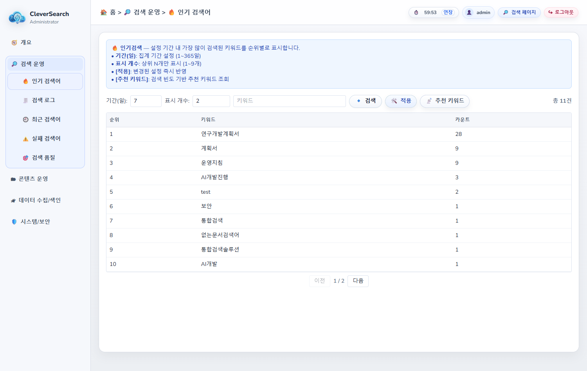

**설명 포인트**
- 실제 검색 로그를 집계한 순위입니다. 이 값이 사용자 검색 화면의 `#인기 검색어` 로 바로 나갑니다.
- 기간 필터로 "이번 주에 뭘 많이 찾았나"를 봅니다.
- **활용**: 상위 검색어는 조직의 현재 관심사입니다. 여기 자주 뜨는 주제의 문서를 우선 정비하면 만족도가 올라갑니다.

---

## 2-4. 검색 로그 / 2-5. 최근 검색어

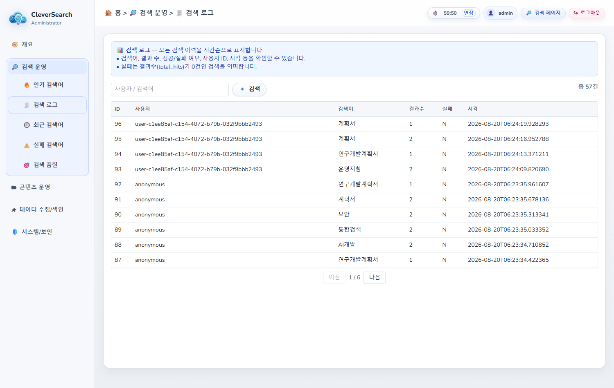

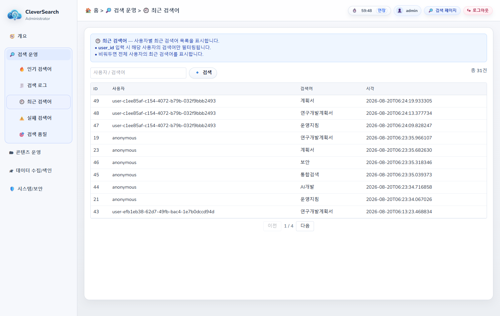

**설명 포인트**
- **검색 로그**: 누가·언제·무엇을 검색해서·몇 건이 나왔는지 전수 기록. 감사 추적용입니다.
- **최근 검색어**: 시간순 흐름. 특정 시점에 갑자기 검색이 몰리면 바로 눈에 띕니다.
- 두 화면 모두 페이징 + 기간 필터를 지원합니다.

---

## 2-6. 실패 검색어 ★ 핵심 시연

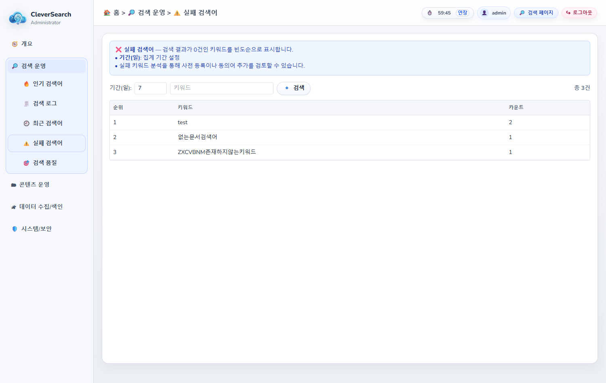

**설명 포인트**
- **결과가 0건이었던 검색어만 모아 보여줍니다.** 이 화면이 이 시스템에서 가장 실무적인 메뉴입니다.
- 읽는 법 — 실패 검색어는 둘 중 하나를 뜻합니다:
  1. **문서가 없다** → 그 문서를 수집·색인하면 됩니다 (→ 데이터 수집/색인 메뉴)
  2. **문서는 있는데 말이 다르다** → 사전에 동의어를 등록하면 됩니다 (→ 사전 관리 메뉴)
- 즉 이 화면은 **"다음에 뭘 해야 하는지"를 시스템이 알려주는 작업 지시서**입니다.

**말할 거리**: "검색이 안 됐다는 사실이 그냥 사라지지 않고 목록으로 쌓입니다. 이걸 하나씩 지워나가는 게 검색 품질 개선 작업입니다."

---

## 2-7. 검색 품질 (가중치 튜닝) ★ 핵심 시연

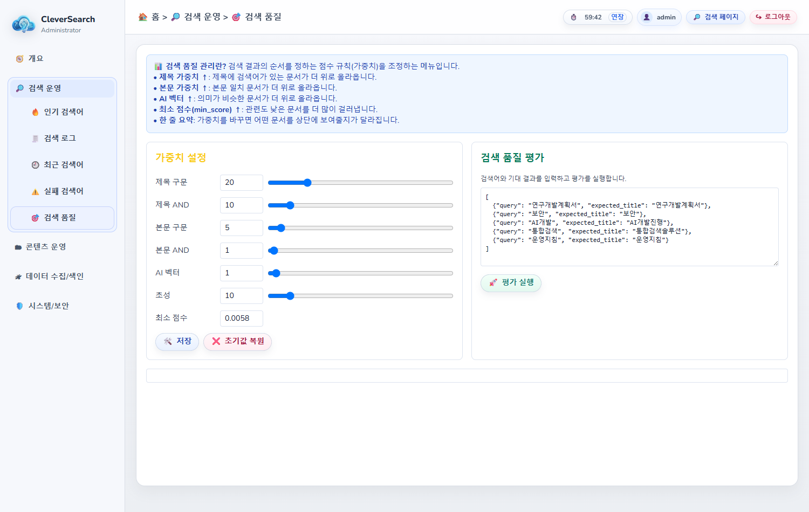

**설명 포인트 — 왼쪽 "가중치 설정"**

검색 결과의 **순서를 정하는 점수 규칙**을 슬라이더로 직접 조정합니다.

| 항목 | 올리면 |
|---|---|
| 제목 구문 (20) | 제목에 검색어가 통째로 든 문서가 위로 |
| 제목 AND (10) | 제목에 단어들이 흩어져 있어도 위로 |
| 본문 구문 (5) | 본문 일치 문서가 위로 |
| 본문 AND (1) | 본문에 단어가 흩어져 있어도 위로 |
| AI 벡터 (1) | **의미가 비슷한** 문서가 위로 (단어가 달라도) |
| 초성 (10) | 초성 검색 결과 우대 |
| 최소 점수 | 올리면 관련도 낮은 문서를 더 많이 걸러냄 |

**오른쪽 "검색 품질 평가"**
- `{"query": "...", "expected_title": "..."}` 형태로 **검색어와 기대 문서를 정의**해두고 **평가 실행**을 누르면, 현재 가중치로 그 문서가 제대로 상위에 오는지 자동 채점합니다.
- **감으로 튜닝하지 않고, 바꾸기 전후를 숫자로 비교**할 수 있습니다.

**말할 거리**: "검색은 '나왔냐 안 나왔냐'가 아니라 '몇 번째로 나왔냐'가 중요합니다. 그 순서를 코드 수정 없이 화면에서 조정하고, 조정 결과를 자동 채점으로 검증합니다."

---

## 2-8. 문서 리스트 / 2-9. 파일 업로드

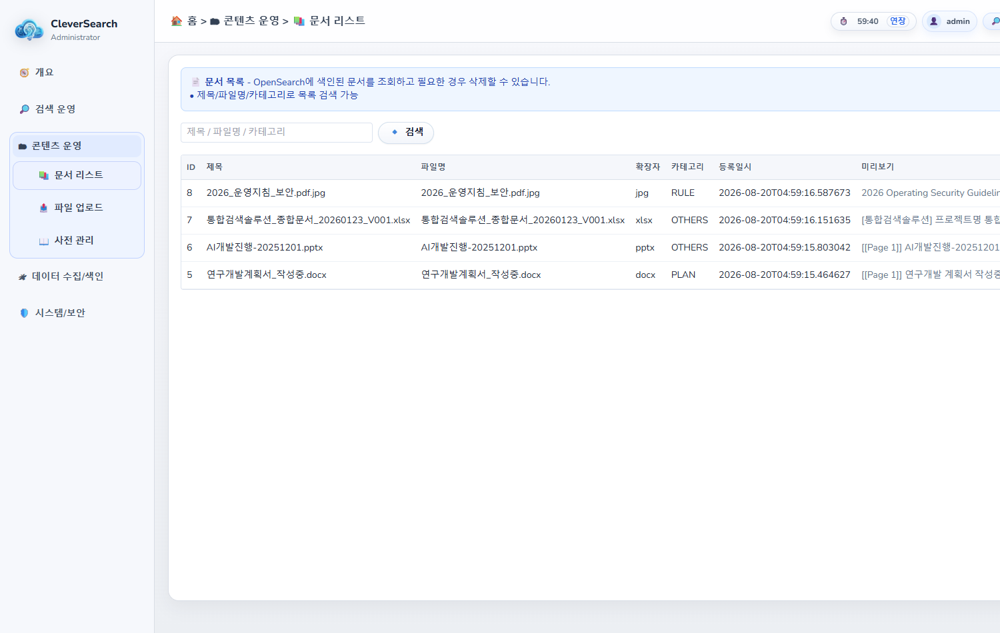

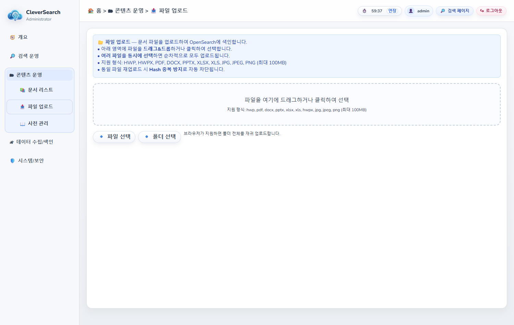

**설명 포인트**
- **문서 리스트**: 현재 색인된 문서 전체를 조회·검색·삭제합니다. "우리가 뭘 갖고 있나"의 목록입니다.
- **파일 업로드**: 드래그앤드롭으로 개별 문서를 즉시 색인합니다.
  - 지원 형식: docx / xlsx / pptx / pdf / 이미지(OCR) / 한글
  - **업로드 보안 검증**: 확장자와 실제 파일 시그니처를 대조해 위장 파일을 차단하고, 중복(해시 기준)을 걸러냅니다.
  - viewer 권한이면 드롭존 자체가 비활성화됩니다.

---

## 2-10. 사전 관리

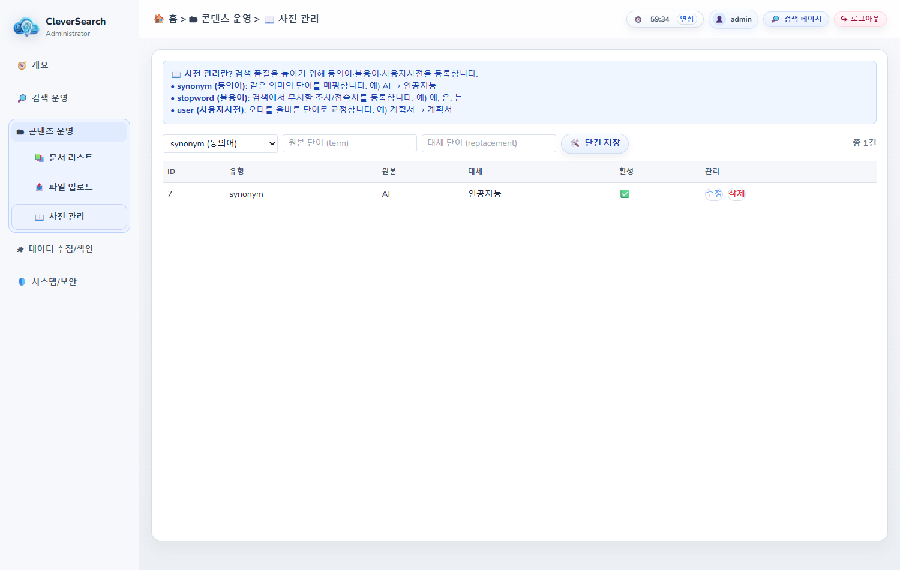

**설명 포인트**
- **동의어 사전**: `AI` = `인공지능` 처럼 등록해두면, 한쪽으로 검색해도 다른 쪽 문서가 잡힙니다.
- **불용어**: 검색에서 무시할 단어 (조사, 흔한 단어)
- **2-6 실패 검색어**에서 나온 단어를 여기 등록하는 것이 개선 루프의 마지막 단계입니다.

**말할 거리**: "실패 검색어 → 사전 등록 → 실패율 감소. 이 순환이 돌아가는 게 이 시스템의 운영 방식입니다."

---

# 발표 마무리 — 개선 루프

```
   ① 사용자가 검색한다
        ↓
   ② 실패한 검색이 기록된다        (검색 로그 / 실패 검색어)
        ↓
   ③ 관리자가 원인을 판단한다
        ├─ 문서가 없음  → 수집·색인 (파일 업로드 / SMB·DB 색인)
        └─ 말이 다름    → 사전 등록 (동의어)
        ↓
   ④ 순서가 이상하면 가중치를 조정하고 자동 채점으로 검증한다
        ↓
   ⑤ 대시보드에서 실패율이 내려가는 걸 확인한다
        ↓
        └──────────── ① 로 돌아감
```

**마지막 한 마디**: "검색 엔진을 붙이는 것보다, **검색이 나빠졌을 때 뭘 봐야 하는지가 정해져 있는 것**이 더 중요합니다. 그 운영 도구를 만든 것이 제 파트입니다."

---

## 부록 — 예상 질문 대비

| 질문 | 답변 |
|---|---|
| 검색이 느리지 않나요? | OpenSearch 기반이고, 색인은 백그라운드 큐에서 처리해 검색 응답에 영향을 주지 않습니다. |
| 인터넷 없는 망에서도 되나요? | 됩니다. Tailwind·Chart.js·폰트를 전부 로컬 사본으로 서빙합니다. |
| 권한 없는 사람이 문서를 보면? | 검색 화면은 공개용이고, 관리자 기능은 JWT + RBAC 3단계로 분리돼 있습니다. |
| 오타 교정이 틀리면요? | 교정했다는 사실과 원본 입력어를 화면에 같이 표시합니다. 사용자가 원문 검색으로 되돌릴 수 있습니다. |
| 품질이 좋아졌는지 어떻게 증명하나요? | 검색 품질 메뉴의 자동 평가와 대시보드 실패율 추이, 두 가지 숫자로 봅니다. |
